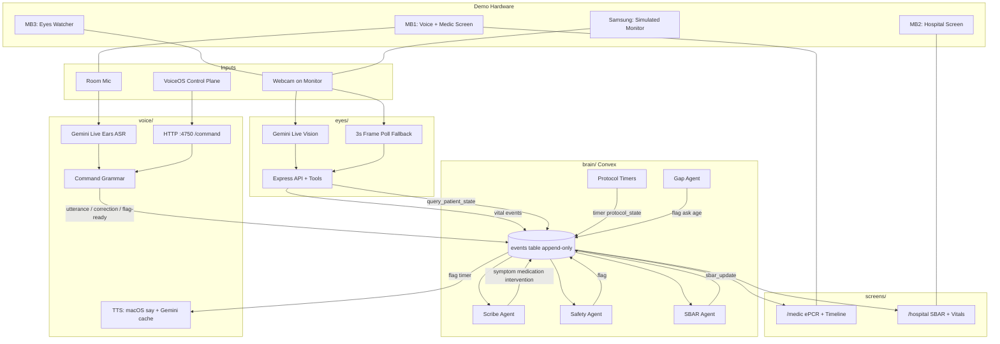
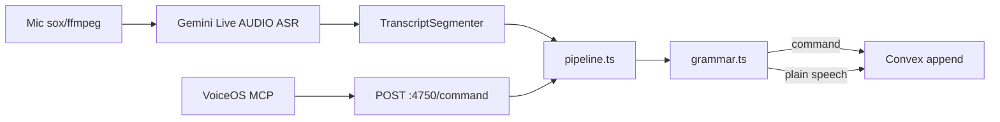
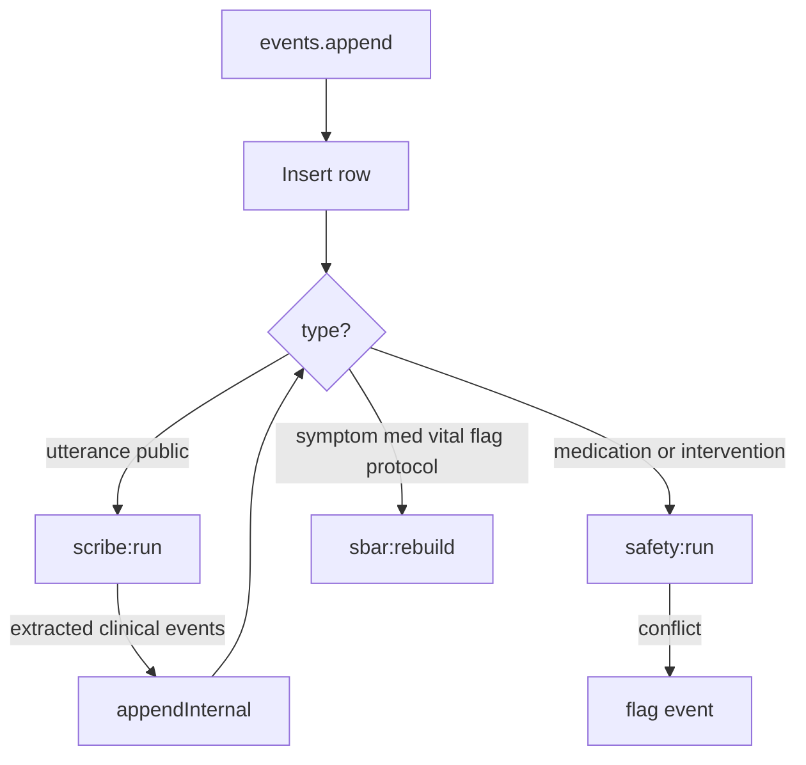
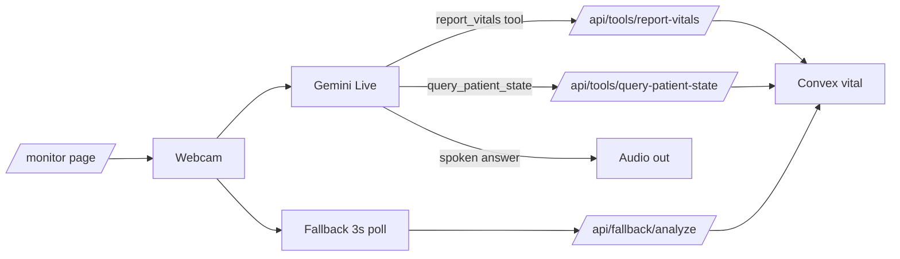
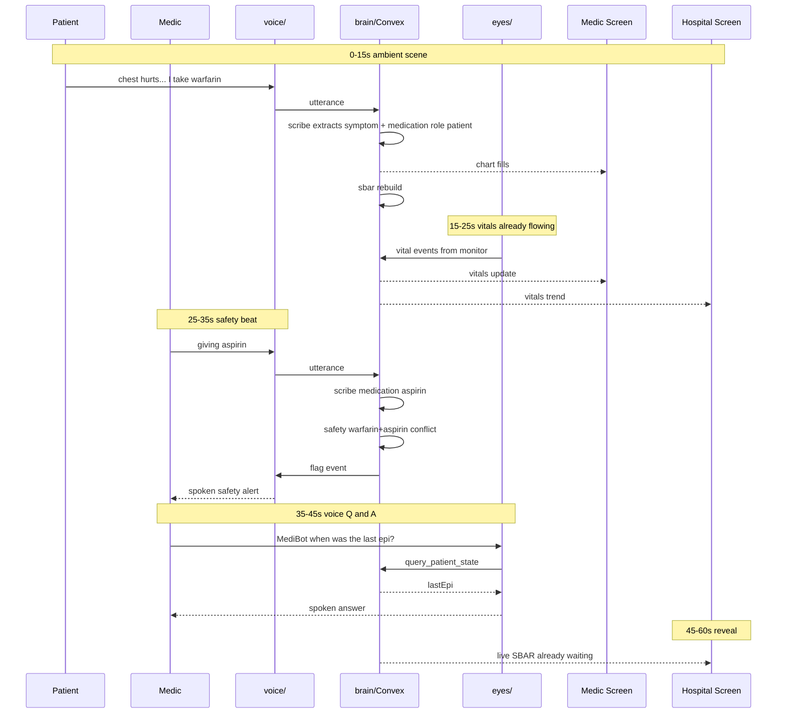

# MediBot — End-to-End System Flow

An ambient AI crew member for paramedics. It:

1. **Listens** to the room and writes the ePCR in real time
2. **Watches** a cardiac monitor via camera + Gemini Live
3. **Speaks** protocol callouts and answers spoken questions
4. **Streams** a live SBAR handoff to a hospital screen before arrival

Everything is derived from one append-only event log in **Convex**. No lane mutates or deletes events; corrections are new events that reference older ones via `refs`.

Team contract and demo plan: [`docs/handoff.md`](docs/handoff.md).

---

## Repo layout (four lanes)

| Directory | Lane | Role |
|---|---|---|
| [`voice/`](voice/) | A | Mic → ASR → events; TTS for flags/timers; VoiceOS command bridge |
| [`brain/`](brain/) | B | Convex schema + agents (scribe, safety, protocol, gap, SBAR) |
| [`screens/`](screens/) | C | Medic view + hospital view (Next.js) |
| [`eyes/`](eyes/) | D | Gemini Live watcher + simulated monitor page |

Lanes call Convex by **string function names** (`anyApi`) — no shared generated types between directories.

---

## System architecture

**Spine rule:** every clinical fact enters as an `events` row. UIs and agents are views / reactors over that log.

---

## The contract: `events` table

Shape (from [`brain/convex/schema.ts`](brain/convex/schema.ts)):

- `ts`, `type`, `source`, `role?`, `payload`, `conf?`, `refs?`, `processed?`

**Types:** `utterance | vital | intervention | medication | symptom | correction | flag | protocol_state | timer | sbar_update`

**Sources:** `voice | vision | agent | system`

**Roles:** `medic | patient | partner | bystander`

Public API used by other lanes (string names):

- `events.append` / `events.timeline`
- `epcr.epcr`, `patientState.patientState`, `sbar.sbar`
- `protocol.start` / `protocol.stop`

Convex deployment (shared): `https://amicable-panther-654.convex.cloud`

See [`brain/README.md`](brain/README.md) for the full function-name contract and agent status.

---

## Lane-by-lane

### A — `voice/` (ears + mouth)

**Run:** `cd voice && npm run dev` (or `npm run fake` for stdin)

**Ingest path:**

1. Mic PCM → Gemini Live “ears” session ([`voice/src/ears.ts`](voice/src/ears.ts)) — audio-in only; model speech discarded
2. Transcript chunks → segmenter → [`voice/src/pipeline.ts`](voice/src/pipeline.ts)
3. Grammar ([`voice/src/grammar.ts`](voice/src/grammar.ts)) detects:
   - Wake word **“Scribe”** (plus fuzzy MediBot manglings)
   - `correction …` → `correction` event
   - `mark …` / given-ish phrases → intervention/medication marks
   - questions → `utterance` with `payload.question`
   - else → plain `utterance`
4. Sink appends to Convex ([`voice/src/convex-sink.ts`](voice/src/convex-sink.ts)), or local JSONL if no `CONVEX_URL`

**Alert path (out):** Convex subscription watches new `flag` / `timer` → TTS speaks `payload.say` or `payload.text`. Mic ducks while speaking (half-duplex).

**VoiceOS:** optional control plane; MCP tools hit `127.0.0.1:4750/command`. Ambient grammar already covers voice-only control without VoiceOS.

### B — `brain/` (agents on the log)

**Run:** `cd brain && npx convex dev`

Routing is centralized in [`brain/convex/events.ts`](brain/convex/events.ts) `insertAndRoute`:

| Agent | File | Trigger | Output |
|---|---|---|---|
| **Scribe** | [`scribe.ts`](brain/convex/scribe.ts) | public `utterance` | Gemini extracts symptom/med/intervention/vital with role; skips command questions |
| **Safety** | [`safety.ts`](brain/convex/safety.ts) | medication/intervention | Deterministic drug-conflict rules → `flag` (e.g. warfarin + aspirin) |
| **Protocol** | [`protocol.ts`](brain/convex/protocol.ts) | `protocol.start` | Scheduler timers; `DEMO_CLOCK=4` compresses ACLS intervals for the 60s demo |
| **Gap** | [`gap.ts`](brain/convex/gap.ts) | after protocol start | Asks missing age via `flag` only in quiet moments |
| **SBAR** | [`sbar.ts`](brain/convex/sbar.ts) | clinical state changes | Rebuilds Situation/Background/Assessment/Recommendation |

Agents write via `appendInternal` so they do not re-trigger the scribe.

### C — `screens/` (two reactive UIs)

**Run:** `cd screens && npm run dev` → localhost:3000

- `/` → redirects to `/medic`
- [`/medic`](screens/src/app/medic/page.tsx) — live ePCR, completeness bar, timeline, provenance on field click
- [`/hospital`](screens/src/app/hospital/page.tsx) — SBAR card, vitals trend, interventions, flag flash

Both subscribe with `useQuery(anyApi.events.timeline, {})` and derive UI client-side via [`screens/src/lib/derive.ts`](screens/src/lib/derive.ts) (corrections hide superseded events). Hospital machine (MB2) updates in <2s via Convex reactivity.

### D — `eyes/` (vision watcher)

**Run:** `cd eyes && npm run dev`

- `/` — watcher (MB3): Start Eyes → webcam + mic → Gemini Live
- `/monitor` — simulated cardiac monitor (Samsung phone), cycling vitals

Server ([`eyes/server/index.ts`](eyes/server/index.ts)) keeps `GEMINI_API_KEY` server-side, mints Live tokens, publishes deduped vitals, answers patient-state queries. Live answers only when addressed (“MediBot” / wake); otherwise silent ambient watch.

Demo hardware checklist: [`eyes/DEMO_RUNBOOK.md`](eyes/DEMO_RUNBOOK.md).

---

## End-to-end usage flow

### Startup (multi-machine demo)

1. **brain** already deployed; all lanes share `CONVEX_URL`
2. **MB1:** `voice/` + optionally `screens` medic view + mic/speaker
3. **MB2:** `screens` hospital view fullscreen
4. **MB3:** `eyes/` watcher; Samsung on same LAN opens `/monitor`
5. Click **Start Eyes** once; after that demo is voice-only

### Runtime loops (always on in parallel)

| Loop | Path | Latency target |
|---|---|---|
| Ambient speech → chart | mic → ears → utterance → scribe → symptom/med → screens | <3s |
| Monitor → vitals | camera → Live tool → vital event → both screens | <5s |
| Safety alert | med event → safety → flag → voice TTS | <5s spoken |
| Protocol callouts | scheduler → timer → voice TTS | deterministic (demo 4×) |
| Spoken Q&A | “Scribe/MediBot, when was last epi?” → eyes Live → query Convex → speak | audio <2.5s |
| Hospital handoff | any clinical event → sbar rebuild → hospital UI | <2s |

### 60-second demo script

| Time | Beat |
|---|---|
| 0–15s | Patient: “chest hurts… I take warfarin” → chart fills, role-attributed |
| 15–25s | Gesture at camera: vitals already logging from the monitor |
| 25–35s | “giving aspirin” → safety agent interrupts aloud (warfarin conflict) |
| 35–45s | “Scribe/MediBot, when was the last epi?” → spoken answer from patient state |
| 45–60s | Reveal hospital SBAR + vitals trend |

---

## External services

| Service | Used by | Purpose |
|---|---|---|
| **Convex** | all lanes | Event spine, scheduler, reactive queries |
| **Google Gemini** | voice, brain, eyes | Live ASR, Live vision+audio, Flash extraction, optional TTS |
| **VoiceOS** | voice (optional) | Spoken control plane → local MCP → `:4750` |
| **macOS `say`** | voice | Instant TTS fallback while Gemini voice caches |

No OpenAI in the current stack (insurance `LLM_PROVIDER` flip exists in [`brain/convex/lib/llm.ts`](brain/convex/lib/llm.ts)).

---

## Ports cheat sheet

| Service | Port | Key env |
|---|---|---|
| screens | **3000** | `NEXT_PUBLIC_CONVEX_URL` |
| eyes | **3000** (LAN `0.0.0.0`) | `GEMINI_API_KEY`, `CONVEX_URL` |
| voice command server | **4750** loopback | `GEMINI_API_KEY`, `CONVEX_URL`, `WAKE_NAME` |
| brain | Convex cloud | `GEMINI_API_KEY`, `LLM_PROVIDER`, `DEMO_CLOCK=4` |

Run screens and eyes on **different machines** (demo map) or change one `PORT` — both default to 3000.

---

## Integration seams

Cross-lane mismatches to watch before a clean demo run:

1. **eyes patientState path** — eyes `.env.example` defaults `CONVEX_PATIENT_STATE_FUNCTION=events:patientState`, but brain exports `patientState:patientState`. Set the env to `patientState:patientState` or Q&A fails.
2. **Vitals payload keys** — eyes publishes `{ hrBpm, spo2Pct, systolicMmHg, diastolicMmHg }`; screens [`derive.ts`](screens/src/lib/derive.ts) primarily maps `hr/spo2/sbp/dbp` or `{name,value}`. Vision vitals may not render on hospital charts until mapped.
3. **Wake word split** — voice wakes on **“Scribe”** (`WAKE_NAME`); eyes Live still prompts for **“MediBot”**. Demo script must match each lane.
4. **`protocol.start`** — public and documented, but no other lane calls it in code today; arm timers via Convex dashboard / `npx convex run` before rehearsal.
5. **`seed:demo`** — inserts rows directly and **bypasses** agent routing, so agents do not fire on seeded data.
6. **VoiceOS install** — UI path may be feature-gated; ambient grammar already covers voice-only control without VoiceOS.

---

## Mental model

**Voice and eyes write facts into Convex; brain agents enrich and police the log; screens read the log; voice speaks the alerts — and nothing else couples those four directories.**
