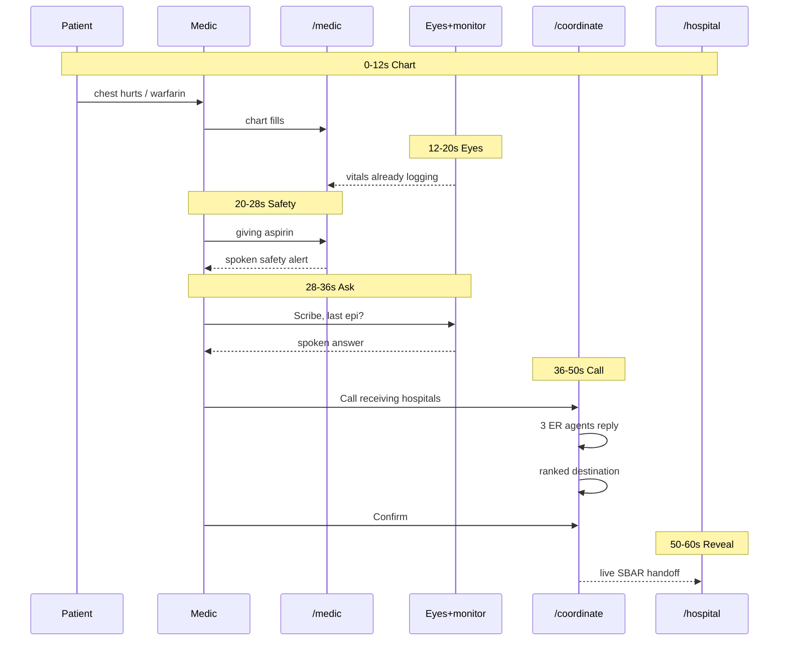
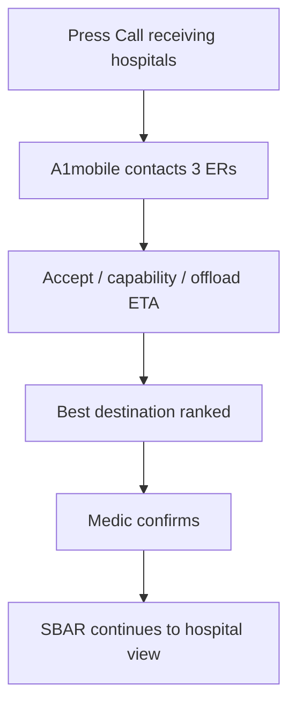

# MediBot — 60-second demo script

## Complete app flow

```mermaid
flowchart LR
  subgraph capture [1 Capture]
    Voice[Voice ambient]
    Eyes[Monitor vision]
  end

  subgraph understand [2 Understand]
    Scribe[Scribe extract]
    Safety[Safety flag]
    Vitals[Vitals + SBAR]
  end

  subgraph call [3 Call hospitals]
    Coord["/coordinate"]
    A1[A1mobile dials ERs]
    Rank[Rank by capability + ETA]
    Confirm[Medic confirms destination]
  end

  subgraph handoff [4 Handoff]
    Hosp["/hospital live SBAR"]
  end

  Voice --> Scribe
  Eyes --> Vitals
  Scribe --> Safety
  Scribe --> Vitals
  Safety --> Vitals
  Vitals --> Coord
  Coord --> A1
  A1 --> Rank
  Rank --> Confirm
  Confirm --> Hosp
```

---

## Screens

| Screen | Job in the demo |
|---|---|
| `/medic` | Chart fills live from ambient speech |
| Eyes + `/monitor` | Vitals from the camera |
| `/coordinate` | Call ERs → rank → confirm |
| `/hospital` | Receiving handoff already waiting |

---

## Preflight

| Machine | Running |
|---|---|
| **MB1** | `voice/` + `/medic` · mic + speaker |
| **MB2** | `/coordinate` ready, then switch to `/hospital` for reveal — or two windows |
| **MB3** | `eyes/` **LIVE** · Samsung `/monitor` in frame |

- Shared `CONVEX_URL` on every lane
- Start Eyes once → hands off keyboard after that
- Seed / ensure `lastEpi` exists so Q&A has an answer
- `/coordinate`: demo mode is fine (no real dials); live dials need allowlisted numbers only

---

## Roles

| Role | Person | Job |
|---|---|---|
| **Medic / presenter** | On mic | Speaks commands, drives `/coordinate`, narrates reveal |
| **Patient** | Teammate | One fixed line only |
| **Operator** | Offstage | Only if Live dies → Force fallback |

---

## 60-second beat map



| Time | Beat | Feature |
|---|---|---|
| 0–12s | Patient line → chart | Ambient scribe |
| 12–20s | Point at monitor | Vision vitals |
| 20–28s | “Giving aspirin” | Safety + TTS |
| 28–36s | “Scribe, last epi?” | Voice Q&A |
| 36–50s | Call ERs → rank → confirm | A1mobile calling |
| 50–60s | Reveal `/hospital` | Live handoff |

---

## Spoken script (exact lines)

### Beat 1 — Chart writes itself (0:00–0:12)

| Who | Line / action |
|---|---|
| Medic | Soft: “Patient’s alert — let’s get history.” |
| Patient | **“My chest hurts. I take warfarin.”** |
| Medic | Point at `/medic` as fields appear |

**Expect:** chief complaint + warfarin, role patient, timeline scrolls.

**Punchline:** “No typing — the chart writes itself.”

---

### Beat 2 — Eyes already watching (0:12–0:20)

| Who | Line / action |
|---|---|
| Medic | Gesture at Samsung + webcam: “Vitals have been streaming the whole time.” |

**Expect:** HR / SpO₂ / BP already on the chart. Eyes header **LIVE**. Do not address Scribe.

---

### Beat 3 — Safety interrupt (0:20–0:28)

| Who | Line / action |
|---|---|
| Medic | **“Giving aspirin.”** |
| MediBot TTS | Speaks warfarin / bleeding conflict |
| Medic | Stay quiet while it speaks |

**Expect:** `flag` + audible alert within ~5s.

---

### Beat 4 — Spoken Q&A (0:28–0:36)

| Who | Line / action |
|---|---|
| Medic | Toward MB3: **“Scribe, when was the last epi?”** |
| Eyes / Scribe | Short spoken answer from Convex |

**Expect:** audio starts fast. One question only — if it fails once, skip to Call.

---

### Beat 5 — Call receiving hospitals (0:36–0:50)



| Who | Line / action |
|---|---|
| Medic | Open `/coordinate` |
| Medic | Press **Call receiving hospitals** |
| Medic | “Three ERs — acceptance, capability, offload.” |
| UI | Shows UCSF / SF General / St. Mary’s replies + ranked pick |
| Medic | Press **Confirm** on the recommended destination |

**Expect (demo mock):**

| Hospital | Result |
|---|---|
| UCSF | Accept · best total time |
| SF General | Accept · slower offload |
| St. Mary’s | Ineligible / no accept |

**Punchline:** “Destination ranked before we leave the scene.”

---

### Beat 6 — Hospital reveal (0:50–0:60)

| Who | Line / action |
|---|---|
| Medic | Reveal `/hospital` (MB2 / projector) |
| Medic | **“Hospital already has the handoff.”** |
| Medic | Point: SBAR · vitals trend · interventions · flag |

**Close:** “Ambient crew — chart, eyes, voice, call, handoff.”

---

## Timing rules

- Patient line is fixed — no improvisation
- Never talk over TTS or Live audio
- If Beat 4 fails once → skip to Call
- If Eyes dies → operator Force fallback silently; keep Beats 1–3–5–6
- After launch: voice + one Call/Confirm click only — no chart typing

---

## Backup / extended (+30s, tape only)

1. Tap warfarin on `/medic` → provenance (source utterance + time)
2. “Correction — BP 90 over 60” → amended value, original still in log
3. “Scribe, mark epi given” → intervention on chart
4. Force fallback on eyes → vitals still append
